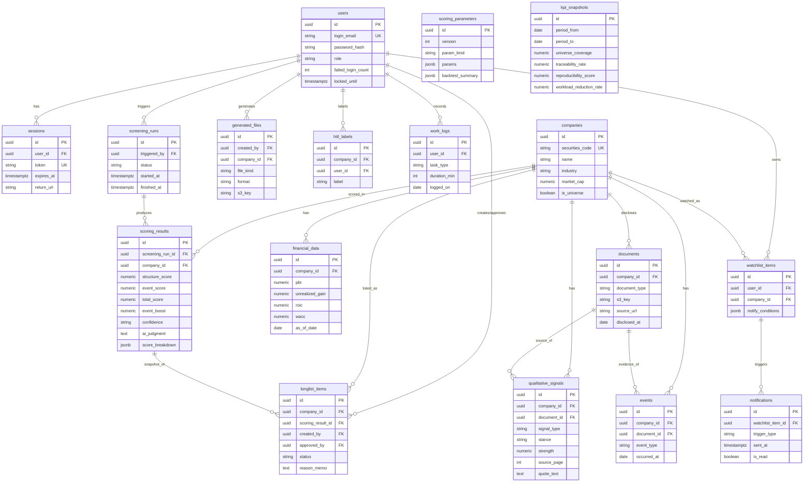

# DB設計書

> IPO一覧（`../ipo/ipo.md`）とデータ項目一覧（`../data/data-list.md`）に基づくDB設計。
> スコア呼称＝構造スコア（定量）／イベントスコア（定性）／総合スコア（派生値）。Phase列：Phase1＝MVP／Phase2＝本番運用。

## クラウド構成からの設計方針

| 項目 | 構成（cloud-diagram / operations） | DB設計への反映 |
|------|----------------------------------|--------------|
| DBエンジン | AWS RDS **PostgreSQL** | UUID主キー・JSONB・配列・全文検索を利用可 |
| ファイルストレージ | **S3** あり | 開示文書・生成レポートの実体はS3。DBは **S3キー/URL** のみ保持 |
| 認証 | 自前認証（Cognito不使用） | `users` に **password_hash** カラムを保持 |
| Read Replica | なし | **正規化優先**（非正規化は最小限） |
| トラフィック | 同時約4名・低RPS、調査期にバッチ集中 | 主要WHERE/JOINキーにインデックス付与。書込集中の `scoring_results` はインデックスを絞る |

- 主キーは原則 `uuid`（`gen_random_uuid()`）。日時は `timestamptz`。
- 列挙値は PostgreSQL の ENUM 型（または `varchar + CHECK`）で表現（本書では「enum」と記載）。
- 証券コードは外部突合の自然キー、企業の主キーは内部 `uuid`（ID重複混在を回避）。

## テーブル一覧

| テーブル名 | 目的 | 関連データ項目 | Phase |
|-----------|------|--------------|-------|
| users | ユーザー・認証・ロール | 1–4,6,8,9 | Phase1 |
| sessions | セッション管理 | 5,6,7 | Phase1 |
| companies | 企業マスタ（中心エンティティ） | 10–15 | Phase1 |
| financial_data | 財務・市場データ（定量指標） | 16–27 | Phase1 |
| documents | 開示文書（出典原本・S3キー） | 28–32 | Phase1 |
| qualitative_signals | 定性シグナル（出典付き） | 33–40 | Phase1 |
| screening_runs | スクリーニング実行（バッチ単位） | 50,51 | Phase1 |
| scoring_results | スコア・確信度・AI判定（実行×企業） | 41–49,52 | Phase1 |
| events | イベント記録（直近イベント/検知） | 53–56 | Phase1 |
| longlist_items | ロングリスト（選定・承認） | 57–62 | Phase1 |
| generated_files | エクスポート/レポート成果物（S3キー） | 63–66 | Phase1 |
| scoring_parameters | 較正パラメータ・重み・検証結果 | 67,68,70 | Phase1/2 |
| hitl_labels | 当たり/外れラベル（学習用） | 69 | Phase2 |
| watchlist_items | ウォッチリスト・通知条件 | 71–73 | Phase2 |
| notifications | 通知履歴 | 74–77 | Phase2 |
| work_logs | 工数ログ（効果検証・手入力） | 78–83 | Phase1 |
| kpi_snapshots | 効果検証KPIスナップショット（導出＋集計） | 84–91 | Phase1 |

## ER図

## テーブル詳細

### users
**目的**: ユーザー・認証・ロール管理（自前認証）

| カラム | 型 | 制約 | 説明 |
|-------|-----|------|------|
| id | uuid | PK, DEFAULT gen_random_uuid() | 主キー |
| login_email | varchar(255) | UNIQUE, NOT NULL | ログインID（メール） |
| password_hash | varchar(255) | NOT NULL | ハッシュ化パスワード |
| role | enum(analyst, manager) | NOT NULL | 担当者/責任者 |
| failed_login_count | integer | NOT NULL DEFAULT 0 | 連続失敗回数 |
| locked_until | timestamptz | NULL | アカウントロック解除時刻 |
| created_at | timestamptz | DEFAULT now() | 作成日時 |
| updated_at | timestamptz | DEFAULT now() | 更新日時 |

### sessions
**目的**: 認証セッション管理（タイムアウト復帰対応）

| カラム | 型 | 制約 | 説明 |
|-------|-----|------|------|
| id | uuid | PK | 主キー |
| user_id | uuid | FK→users.id, NOT NULL | 所有ユーザー |
| token | varchar(255) | UNIQUE, NOT NULL | セッショントークン |
| expires_at | timestamptz | NOT NULL | 有効期限 |
| return_url | varchar(1024) | NULL | タイムアウト時の復帰先URL |
| created_at | timestamptz | DEFAULT now() | 作成日時 |

### companies
**目的**: 企業マスタ（全テーブルが参照する中心エンティティ）

| カラム | 型 | 制約 | 説明 |
|-------|-----|------|------|
| id | uuid | PK | 内部主キー |
| securities_code | varchar(10) | UNIQUE, NOT NULL | 証券コード（外部突合の自然キー） |
| name | varchar(255) | NOT NULL | 企業名 |
| industry | varchar(100) | NOT NULL | 業種（z-score正規化の基準） |
| market_cap | numeric(18,2) | NULL | 時価総額 |
| is_universe | boolean | NOT NULL DEFAULT false | 母集団に含まれるか |
| created_at / updated_at | timestamptz | DEFAULT now() | 作成/更新日時 |

### financial_data
**目的**: 財務・市場データ（基準日ごと。構造スコアの算出元）

| カラム | 型 | 制約 | 説明 |
|-------|-----|------|------|
| id | uuid | PK | 主キー |
| company_id | uuid | FK→companies.id, NOT NULL | 対象企業 |
| as_of_date | date | NOT NULL | データ基準日 |
| revenue | numeric(18,2) | NULL | 売上高 |
| pbr | numeric(8,3) | NULL | PBR |
| adjusted_pbr | numeric(8,3) | NULL | 修正PBR（含み益調整後） |
| equity_ratio | numeric(6,3) | NULL | 自己資本比率 |
| re_market_value | numeric(18,2) | NULL | 賃貸等不動産 時価 |
| re_book_value | numeric(18,2) | NULL | 賃貸等不動産 簿価 |
| unrealized_gain | numeric(18,2) | NULL | 含み益（時価−簿価） |
| unrealized_gain_ratio | numeric(8,4) | NULL | 含み益倍率（含み益/時価総額） |
| roic | numeric(8,4) | NULL | 対象資産ROIC |
| wacc | numeric(8,4) | NULL | WACC |
| stock_price | numeric(12,2) | NULL | 株価 |
| 制約 | — | UNIQUE(company_id, as_of_date) | 企業×基準日で一意 |

### documents
**目的**: 開示文書（出典の原本。実体はS3、DBはキー保持）

| カラム | 型 | 制約 | 説明 |
|-------|-----|------|------|
| id | uuid | PK | 主キー |
| company_id | uuid | FK→companies.id, NOT NULL | 対象企業 |
| document_type | enum(yuho, mid_term_plan, timely_disclosure, large_shareholding) | NOT NULL | 文書種別 |
| s3_key | varchar(1024) | NULL | 本文/抽出テキストのS3キー |
| source_url | varchar(1024) | NOT NULL | EDINET等の開示原文URL |
| disclosed_at | date | NOT NULL | 開示日 |
| created_at | timestamptz | DEFAULT now() | 取込日時 |

### qualitative_signals
**目的**: 定性シグナル（イベントスコア根拠。出典・原文照合済み）

| カラム | 型 | 制約 | 説明 |
|-------|-----|------|------|
| id | uuid | PK | 主キー |
| company_id | uuid | FK→companies.id, NOT NULL | 対象企業 |
| document_id | uuid | FK→documents.id, NOT NULL | 出典文書（トレース起点） |
| signal_type | enum(activist_proposal, capital_efficiency_target, sale_suggestion, other) | NOT NULL | シグナル種別 |
| stance | enum(support, counter) | NOT NULL | 支持/反証（売却否定） |
| strength | numeric(5,2) | NULL | 強度（重み付け） |
| recency | date | NULL | シグナルの新しさ |
| source_page | integer | NOT NULL | 出典ページ |
| quote_text | text | NOT NULL | 原文引用 |
| created_at | timestamptz | DEFAULT now() | 抽出日時 |

### screening_runs
**目的**: 一括スクリーニング（バッチ）の実行単位

| カラム | 型 | 制約 | 説明 |
|-------|-----|------|------|
| id | uuid | PK | 主キー |
| triggered_by | uuid | FK→users.id | 実行ユーザー（担当者/責任者） |
| status | enum(running, success, failed) | NOT NULL | 実行ステータス |
| is_current | boolean | NOT NULL DEFAULT false | 現在の有効スコアセットか（常に最大1件がtrue） |
| started_at | timestamptz | NOT NULL | 開始日時 |
| finished_at | timestamptz | NULL | 終了日時 |
| duration_ms | integer | NULL | 所要時間 |

> **現在値の定義**: スコアリング実行が `status=success` で完了した時、当該runを `is_current=true`・他の全runを `false` に**原子的更新**（トランザクション内で一括更新し、常に最大1件のみtrue）。
> ランキング・企業詳細・KPI・母集団カバレッジが参照する `scoring_results` は、**`is_current=true` の実行に紐づくもの**に限定する。

### scoring_results
**目的**: 実行×企業のスコア・確信度・AI判定（書込集中→索引最小化）

| カラム | 型 | 制約 | 説明 |
|-------|-----|------|------|
| id | uuid | PK | 主キー |
| screening_run_id | uuid | FK→screening_runs.id, NOT NULL | 実行単位 |
| company_id | uuid | FK→companies.id, NOT NULL | 対象企業 |
| structure_score | numeric(5,2) | NOT NULL | 構造スコア（0–100） |
| event_score | numeric(5,2) | NOT NULL | イベントスコア |
| total_score | numeric(6,2) | NOT NULL | 総合スコア（並び順キー） |
| event_boost | numeric(5,2) | NULL | イベントブースト倍率 |
| confidence | enum(high, mid, low) | NOT NULL | 確信度/データ充足度 |
| ai_judgment | text | NULL | AI総合判定コメント |
| judgment_refs | jsonb | NULL | 判定が参照した根拠（指標/シグナルID） |
| score_breakdown | jsonb | NULL | スコア寄与内訳 |
| prev_total_score | numeric(6,2) | NULL | 差分ハイライト用前回スコア（Phase2） |
| created_at | timestamptz | DEFAULT now() | 作成日時 |
| 制約 | — | UNIQUE(screening_run_id, company_id) | 実行×企業で一意 |

### events
**目的**: イベント記録（P001直近イベント、Phase2検知）

| カラム | 型 | 制約 | 説明 |
|-------|-----|------|------|
| id | uuid | PK | 主キー |
| company_id | uuid | FK→companies.id, NOT NULL | 対象企業 |
| document_id | uuid | FK→documents.id, NULL | 関連開示（あれば） |
| event_type | enum(new_disclosure, large_shareholding) | NOT NULL | イベント種別 |
| occurred_at | date | NOT NULL | 発生日（直近7日抽出） |
| created_at | timestamptz | DEFAULT now() | 記録日時 |

### longlist_items
**目的**: ロングリスト（選定・承認）

| カラム | 型 | 制約 | 説明 |
|-------|-----|------|------|
| id | uuid | PK | 主キー |
| company_id | uuid | FK→companies.id, NOT NULL | 選定企業 |
| scoring_result_id | uuid | FK→scoring_results.id, NULL | 選定時点のスコアスナップショット |
| status | enum(candidate, approved, rejected) | NOT NULL DEFAULT 'candidate' | ステータス |
| reason_memo | varchar(500) | NULL | 選定理由メモ（最大500字） |
| created_by | uuid | FK→users.id, NOT NULL | 登録者（担当者） |
| created_at | timestamptz | DEFAULT now() | 登録日時 |
| approved_by | uuid | FK→users.id, NULL | 承認/却下した責任者 |
| approved_at | timestamptz | NULL | 承認/却下日時 |
| 制約 | — | UNIQUE(company_id) | 同一企業の重複登録を抑止 |

> **前提**: `UNIQUE(company_id)` は **部内共有の単一ロングリスト**前提（担当者別リストは持たず、部で1つのリストを共有）。担当者ごとに別リストを持たせる業務要件に変わった場合は、`UNIQUE(company_id, owner_id)` 等へ制約を見直す。

### generated_files
**目的**: エクスポート/レポート成果物（実体はS3）

| カラム | 型 | 制約 | 説明 |
|-------|-----|------|------|
| id | uuid | PK | 主キー |
| created_by | uuid | FK→users.id, NOT NULL | 生成ユーザー |
| company_id | uuid | FK→companies.id, NULL | 個社レポート時の対象（一覧出力はNULL） |
| file_kind | enum(export, report) | NOT NULL | 一覧エクスポート/個社レポート |
| format | enum(csv, excel, pdf, pptx) | NOT NULL | 出力形式 |
| s3_key | varchar(1024) | NOT NULL | 成果物のS3キー |
| created_at | timestamptz | DEFAULT now() | 生成日時 |

### scoring_parameters
**目的**: 較正パラメータ・重み・検証結果

| カラム | 型 | 制約 | 説明 |
|-------|-----|------|------|
| id | uuid | PK | 主キー |
| version | integer | NOT NULL | バージョン |
| param_kind | enum(calibrated, hitl_updated) | NOT NULL | 較正(A6)/学習更新(A7) |
| params | jsonb | NOT NULL | しきい値・重み |
| backtest_summary | jsonb | NULL | バックテスト検証結果 |
| is_active | boolean | NOT NULL DEFAULT false | 現行採用フラグ |
| created_at | timestamptz | DEFAULT now() | 作成日時 |

### hitl_labels（Phase2）
**目的**: 担当者の当たり/外れラベル（学習用）

| カラム | 型 | 制約 | 説明 |
|-------|-----|------|------|
| id | uuid | PK | 主キー |
| company_id | uuid | FK→companies.id, NOT NULL | 対象企業 |
| user_id | uuid | FK→users.id, NOT NULL | ラベル付与者 |
| label | enum(hit, miss) | NOT NULL | 当たり/外れ |
| created_at | timestamptz | DEFAULT now() | 付与日時 |

### watchlist_items（Phase2）
**目的**: ウォッチリスト・通知条件

| カラム | 型 | 制約 | 説明 |
|-------|-----|------|------|
| id | uuid | PK | 主キー |
| user_id | uuid | FK→users.id, NOT NULL | 所有ユーザー |
| company_id | uuid | FK→companies.id, NOT NULL | ウォッチ対象 |
| notify_conditions | jsonb | NOT NULL | しきい値・イベント種別 |
| notify_channel | varchar(255) | NULL | 通知先（メール/Slack） |
| created_at | timestamptz | DEFAULT now() | 登録日時 |
| 制約 | — | UNIQUE(user_id, company_id) | 重複ウォッチ抑止 |

### notifications（Phase2）
**目的**: 通知履歴

| カラム | 型 | 制約 | 説明 |
|-------|-----|------|------|
| id | uuid | PK | 主キー |
| watchlist_item_id | uuid | FK→watchlist_items.id, NOT NULL | 関連ウォッチ |
| trigger_type | enum(score_threshold, new_disclosure, large_shareholding) | NOT NULL | 通知トリガー |
| sent_at | timestamptz | NOT NULL | 送出日時 |
| is_read | boolean | NOT NULL DEFAULT false | 既読フラグ |

### work_logs
**目的**: 工数ログ（効果検証の工数削減を計測する手入力データ）

| カラム | 型 | 制約 | 説明 |
|-------|-----|------|------|
| id | uuid | PK | 主キー |
| user_id | uuid | FK→users.id, NOT NULL | 記録者 |
| task_type | enum(primary_screening, deep_dive, report, other) | NOT NULL | タスク種別 |
| duration_min | integer | NOT NULL | 所要時間（分） |
| screening_run_id | uuid | FK→screening_runs.id, NULL | 紐づく実行（任意） |
| period_label | varchar(50) | NULL | 対象期間ラベル（実行に紐づかない場合） |
| logged_on | date | NOT NULL | 記録日 |
| created_at | timestamptz | DEFAULT now() | 作成日時 |

### kpi_snapshots
**目的**: 効果検証KPIの算出結果（導出＋集計のスナップショット）

| カラム | 型 | 制約 | 説明 |
|-------|-----|------|------|
| id | uuid | PK | 主キー |
| period_from | date | NOT NULL | 集計対象期間（開始） |
| period_to | date | NOT NULL | 集計対象期間（終了） |
| universe_coverage | numeric(5,2) | NULL | 母集団カバレッジ率（is_universe×scoring_resultsから導出） |
| traceability_rate | numeric(5,2) | NULL | トレース可能率（qualitative_signals/documentsから導出） |
| avg_structure_score | numeric(5,2) | NULL | 平均構造スコア（導出） |
| reproducibility_score | numeric(5,2) | NULL | 再現性スコア（同一入力の上位リスト一致率） |
| total_workload_min | integer | NULL | work_logs集計工数（分） |
| workload_reduction_rate | numeric(5,2) | NULL | As-Is(500h)比の削減率 |
| created_at | timestamptz | DEFAULT now() | 作成日時 |

> 導出系（coverage/traceability/avg/reproducibility）は既存テーブルから集計して保存（参照高速化のためのスナップショット）。工数のみ `work_logs` の手入力を集計。
> **生成トリガー**: `kpi_snapshots` は **スクリーニング実行完了フック**（`screening_runs` が success 確定時）または**スケジュールバッチ**で生成する（API非公開）。画面の `GET /api/kpi/effectiveness` は最新スナップショットの**読み取り専用**で、参照時に書き込みは行わない。

## インデックス方針

| テーブル | インデックス | 理由 |
|---------|------------|------|
| users | UNIQUE(login_email) | ログイン照合 |
| sessions | UNIQUE(token), INDEX(user_id) | トークン検証 |
| companies | UNIQUE(securities_code), INDEX(industry) | 突合・業種フィルタ/z-score |
| financial_data | UNIQUE(company_id, as_of_date) | 最新基準日の取得 |
| qualitative_signals | INDEX(company_id), INDEX(document_id) | 詳細表示・出典トレース |
| screening_runs | INDEX(is_current, status) | 現在の有効実行の特定 |
| scoring_results | UNIQUE(screening_run_id, company_id), INDEX(screening_run_id), INDEX(total_score DESC) | 現在実行の結果取得・ランキング並び順（書込集中のため索引は最小限） |
| events | INDEX(occurred_at), INDEX(company_id) | 直近7日抽出 |
| longlist_items | UNIQUE(company_id), INDEX(status) | 重複抑止・ステータス絞り込み |
| watchlist_items | UNIQUE(user_id, company_id) | 重複ウォッチ抑止 |
| work_logs | INDEX(logged_on), INDEX(user_id) | 期間集計・記録者別集計 |
| kpi_snapshots | INDEX(period_from, period_to) | 期間別のKPI参照 |

## 正規化の検討

- 第3正規形を基本とし、`companies` を中心にスコア・財務・文書・シグナル・イベントを分離。
- **意図的な非正規化（最小限）**：`longlist_items.scoring_result_id` で選定時点のスコアを参照保持し、再計算後も選定根拠を再現可能にする（履歴の一貫性）。エクスポート/レポートのスコア値は `scoring_results` をJOINして都度取得（重複保持しない）。
- ファイル実体はS3に置き、DBは `s3_key`/`source_url` のみ保持（DBにファイルを持たない原則）。
- Read Replicaがないため、表示性能はインデックスで担保し、非正規化は上記1点に留める。
