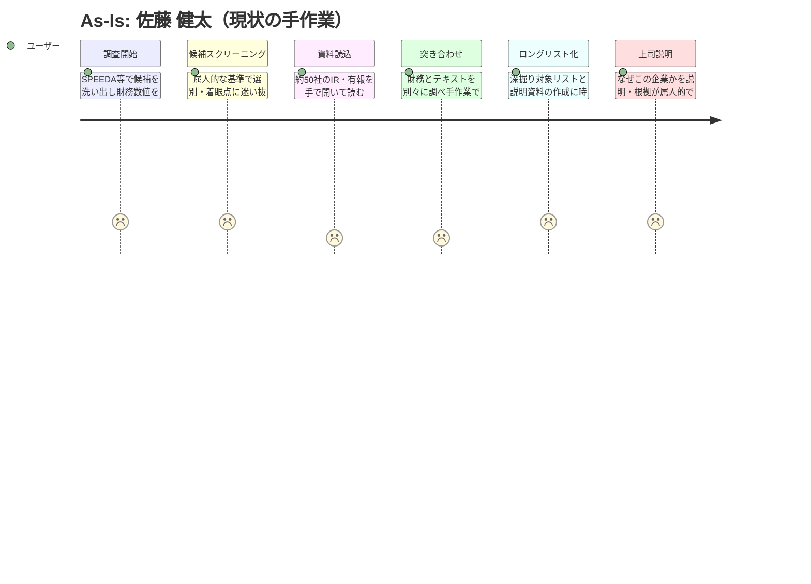
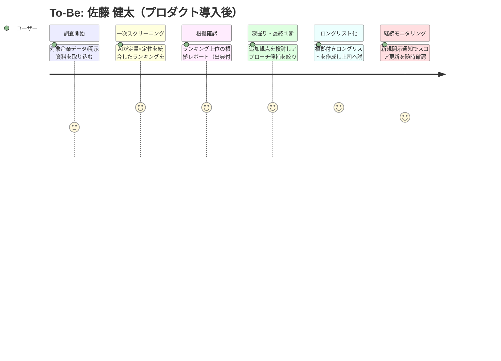
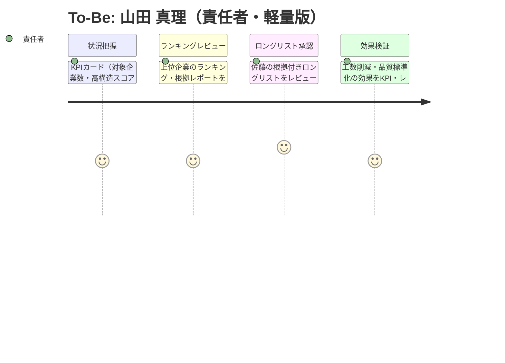

# ユーザージャーニー

対象ペルソナ: **佐藤 健太（担当者・メイン）** / **山田 真理（責任者・軽量版）**
描画方針: As-Is（現状の手作業）→ To-Be（プロダクト導入後）の対比

---

## ペルソナ①: 佐藤 健太（担当者・主ユーザー）

| 項目 | 内容 |
|-----|------|
| ペルソナ | 佐藤 健太（32歳・主任クラス） |
| ユーザー像 | 事業開発企画部の担当者。財務分析は得意だがSQL/プログラミングは不可。年500時間リサーチの主担い手 |
| 課題 | 年2回・約50社の有報手読み、定量×定性の手作業突き合わせ、属人的な着眼点による見落とし不安 |
| 利用シーン | 年2回の調査期に集中。新規開示は随時確認。PC中心 |

### As-Is ジャーニー（現状の手作業）

> 低スコアが連続（年500時間の負荷）。**ここがアプリで潰す対象。**

### To-Be ジャーニー（プロダクト導入後）

> **Phase補足**: デモ画面の「直近7日の新規イベント企業／イベントスコア」はPhase1ではスナップショットデータ上のプレビュー表示。実際の自動検知・随時更新はPhase2。

### メインフロー（As-Is → To-Be）

| # | フェーズ | As-Is の行動 | 課題・感情 | To-Be の解決 |
|---|---------|------|----------|------|
| 1 | 調査開始 | SPEEDA等で候補を洗い出し、財務数値を一社ずつ確認 | 手間がかかる（2） | EDINET・yfinanceで対象企業データ/開示資料を自動収集（3） |
| 2 | スクリーニング | 属人的な基準で選別、着眼点に迷い抜け漏れ不安 | 不安・属人的（2） | AIが定量×定性を統合したランキングを自動生成（5） |
| 3 | 資料読込・突き合わせ | 約50社の有報を手読みし、財務とテキストを手作業で突き合わせ | 最も重い負荷（1） | ランキング上位の根拠レポート（出典付き引用）を確認（5） |
| 4 | 深掘り・判断 | 深掘り対象リストと説明資料の作成に時間 | 時間がかかる（2） | 追加観点を検討し、アプローチ候補を絞り込む（5） |
| 5 | ロングリスト化・説明 | 「なぜこの企業か」を属人的根拠で説明、説得に苦労 | 説得に苦労（2） | 根拠付きロングリストを作成し、上司へ説明・提出（5） |
| 6 | 継続モニタリング | （現状はなし／調査期のみ） | 取りこぼし | 新規開示通知でスコア更新を随時確認（Phase2）（4） |

### 感情の変化（佐藤）

- **開始時**: 調査期の負荷を予感し気が重い（As-Is）／自動収集で立ち上がりが軽い（To-Be）
- **最初のつまずき**: 約50社の手読みと手作業の突き合わせで疲弊（As-Is最低点）
- **ブレークスルー**: AIランキングと出典付き根拠レポートで一気に視界が開ける（To-Be）
- **ゴール達成時**: 根拠付きロングリストを自信を持って上司に説明できる

---

## ペルソナ②: 山田 真理（責任者・軽量版）

| 項目 | 内容 |
|-----|------|
| ペルソナ | 山田 真理（48歳・部長／グループ長） |
| ユーザー像 | マネジメント職。詳細分析は担当に委譲。AI活用を方針として推進 |
| 課題 | 着眼点のばらつきによる品質不安、年500時間の業務圧迫、効果が定量で見えず経営に説明しづらい |
| 利用シーン | 週次〜月次でKPI・レポート確認。調査期にロングリストをレビュー・承認 |

### To-Be ジャーニー（軽量版）

### メインフロー（山田）

| # | フェーズ | 行動 | 課題・感情 | 解決 |
|---|---------|------|----------|------|
| 1 | 状況把握 | ダッシュボードのKPIカードで全体把握 | 全体像を素早く（4） | 対象企業数・高構造スコア社数・平均構造スコア・直近イベントを一覧 |
| 2 | ランキングレビュー | 上位企業のランキング・根拠レポートを点検 | 基準どおりか確認（4） | 出典付き根拠で選定基準の標準化を確認 |
| 3 | ロングリスト承認 | 佐藤の根拠付きロングリストをレビュー・承認 | 妥当性に納得（5） | 根拠が透明なので自信を持って承認 |
| 4 | 効果検証 | 工数削減・品質標準化の効果をKPI・レポートで確認 | 経営に説明できる（4） | 定量KPIで効果を可視化 |

> **山田のAs-Isの代表的痛点**: 効果が定量で見えず経営に説明しづらい（感情=2）。To-BeではKPIカードで可視化され解消。

### 感情の変化（山田）

- **開始時（As-Is）**: 効果が定量で見えず経営説明に苦労（2）
- **ブレークスルー**: KPIカードで工数削減・品質標準化が一目で見える
- **ゴール達成時**: 根拠の透明性をもって承認・経営説明ができる（4-5）
