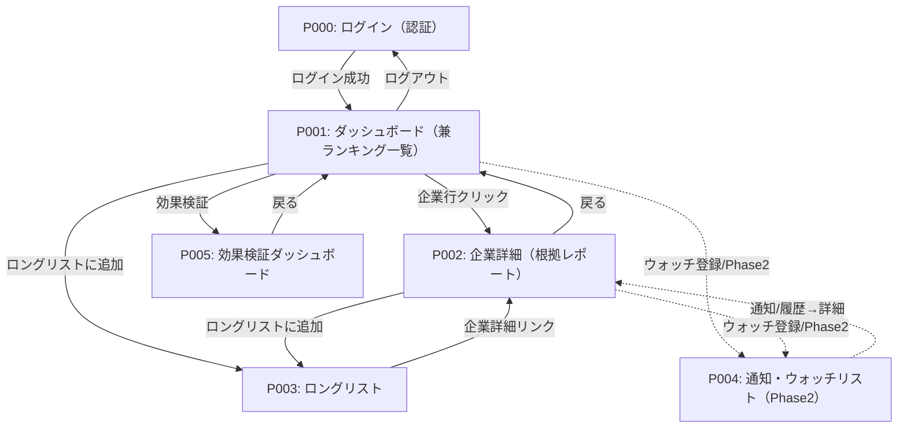

# 画面フロー・遷移図

## 概要
| 項目 | 内容 |
|------|------|
| プロジェクト | 不動産売却スクリーニング（property-sale-screening） |
| Sprint | Sprint 3 |
| 作成日 | 2026-06-22 |
| フェーズ | Phase1（6ヶ月後デモ）MVP：一括スクリーニング → 統合ランキング → 出典付き根拠レポート → デモ画面 |

## ページリスト（確定版）

| ページID | ページ名 | 説明 |
|---------|---------|------|
| P000 | ログイン（認証） | 認証・認可。Sprint3セキュリティ軸の実証。許可ユーザーのみアクセス可 |
| P001 | ダッシュボード（兼 企業ランキング一覧） | KPIカード＋直近イベントバナー＋企業ランキング＋フィルタ＋スクリーニング実行/再読込。入口 |
| P002 | 企業詳細（根拠レポート） | 1社の構造スコア（定量）×イベントスコア（定性）内訳と出典付き根拠（document_type・source_page・引用文）、AI総合判定 |
| P003 | ロングリスト | 選定済み深掘り対象の管理・上司レビュー/承認・CSV/Excelエクスポート |
| P004 | 通知・ウォッチリスト（**Phase2**） | 関心企業のウォッチ登録・通知条件設定・通知履歴。継続モニタリングのUI受け皿（Phase1では非提供） |
| P005 | 効果検証ダッシュボード | 工数削減・品質標準化（再現性）・母集団カバレッジ・トレース可能率を計測・可視化（ハイブリッド：導出＋工数ログ手入力）。主に責任者が利用 |

> **非画面の処理要件**: 各画面のInputとなる「構造/イベント/総合スコア・指標・定性シグナル・確信度」の生成ロジックは `specifications/scoring-and-pipeline.md`（非画面）および `requirements-v1/scoring-and-pipeline.md` に定義（画面ではないため本ページリストには含めない）。

## ページ関係表

| ページ名 | 説明 | 遷移元 | 遷移先 | 遷移トリガー |
|--------|------|--------|--------|------------|
| P000 ログイン | 認証・認可 | -（直接アクセス／未認証リダイレクト） | P001 | ログインボタン（認証成功） |
| P001 ダッシュボード | 全体把握・ランキング閲覧・選定起点 | P000, P002, P003, P005 | P002, P003, P000, P005, P004（Phase2） | 企業行クリック→P002／「ロングリストに追加」→P003／効果検証→P005／ログアウト→P000／ウォッチ登録→P004（Phase2） |
| P002 企業詳細 | 根拠レポート・最終判断 | P001, P003, P004 | P001, P003, P004（Phase2） | 戻る→P001／「ロングリストに追加」→P003／ウォッチ登録→P004（Phase2） |
| P003 ロングリスト | 管理・承認・エクスポート | P001, P002 | P002 | 企業詳細リンク→P002 |
| P004 通知・ウォッチリスト（Phase2） | ウォッチ登録・通知・履歴 | P001, P002（登録動線） | P002 | 通知/履歴→P002 |
| P005 効果検証ダッシュボード | 効果検証KPIの可視化・工数ログ入力 | P001 | P001 | 効果検証→P005／戻る→P001 |

## ページ遷移図

> 点線（-.->）は **Phase2** の遷移。Phase1（Sprint3 MVP）では P000〜P003 と P005（効果検証）を提供し、P004 のみ Phase2。

## 補足

- 各Pageの詳細仕様は `specifications/P00X_*.md` を参照
- 認証：未認証で P001〜P003 にアクセスした場合は P000 へリダイレクト。**セッションタイムアウト時は復帰先URLを保持し、再ログイン後に元画面へ戻す**
- 認証セキュリティ（P000）：パスワードポリシー、ログイン試行回数制限＋アカウント一時ロック、認証レート制限（ブルートフォース対策）
- 認可：P003 の承認／却下は責任者ロールのみ。スクリーニング実行（P001）・レポート出力（P002）・エクスポート（P003）は担当者・責任者ともに可
- **異常系の共通方針**：処理失敗時は「エラー表示＋再試行導線」を共通パターンとする（通知連携はPhase2）。各画面のUI状態遷移に失敗状態を定義
- 直近イベント／新規開示通知は Phase1 では P001 内のスナップショット表示。自動検知・独立モニタリング画面は Phase2
- スクリーニング実行は独立画面を持たず、P001 のボタンとして配置（実行専用画面は設けない）
- 効果検証は P005（独立画面）として提供。P001 から遷移し、責任者の効果検証ステップを担う
- エラーハンドリング時の画面遷移は各Page仕様書で詳述。モーダル・ポップアップは遷移図では簡略化
